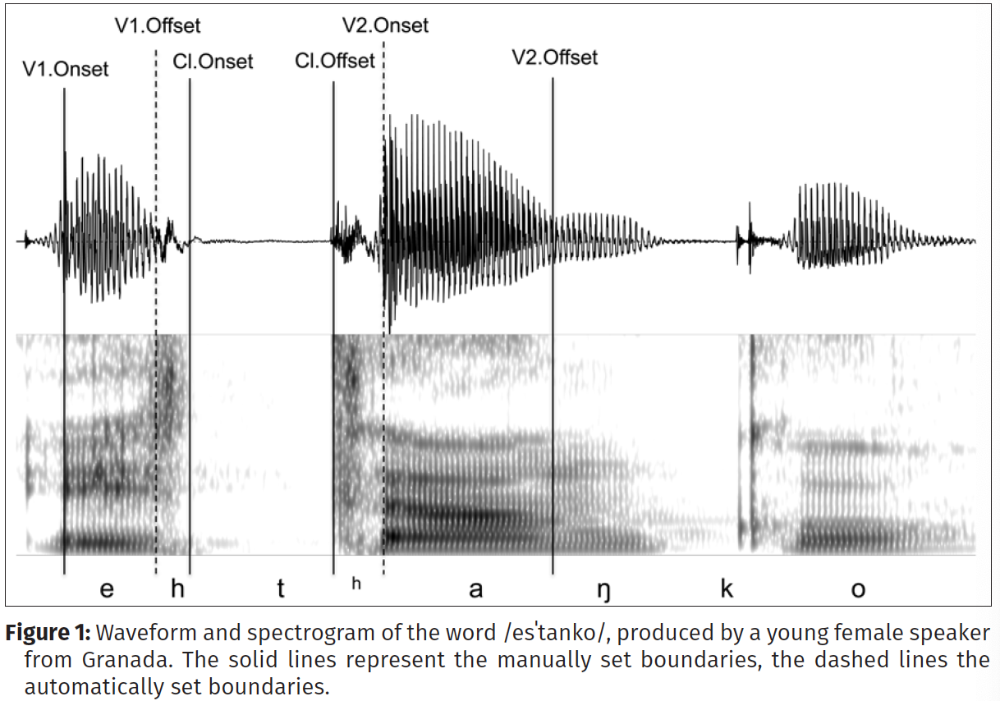
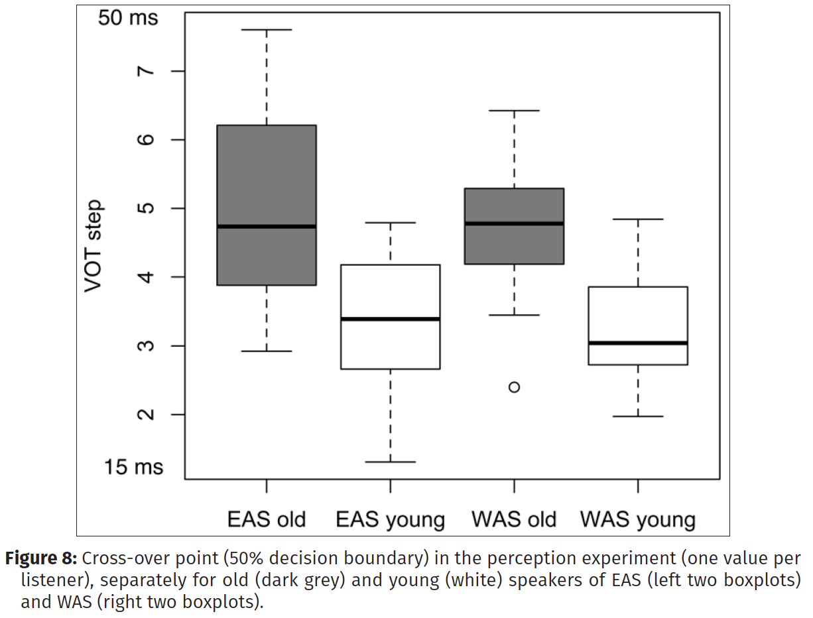
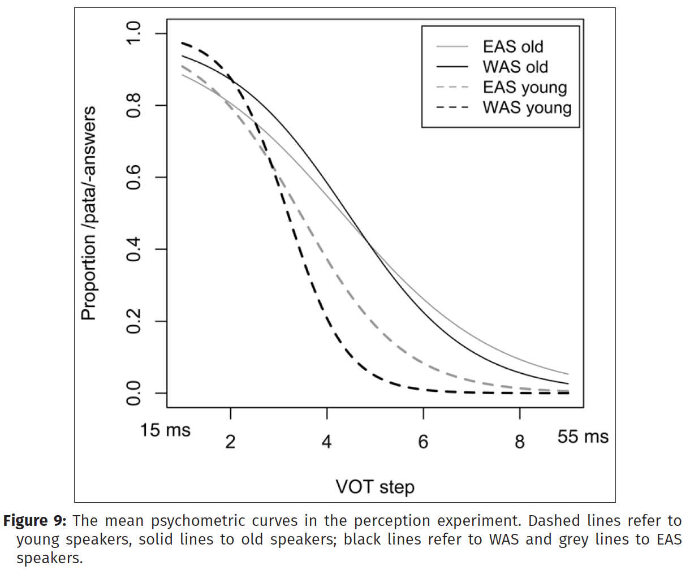
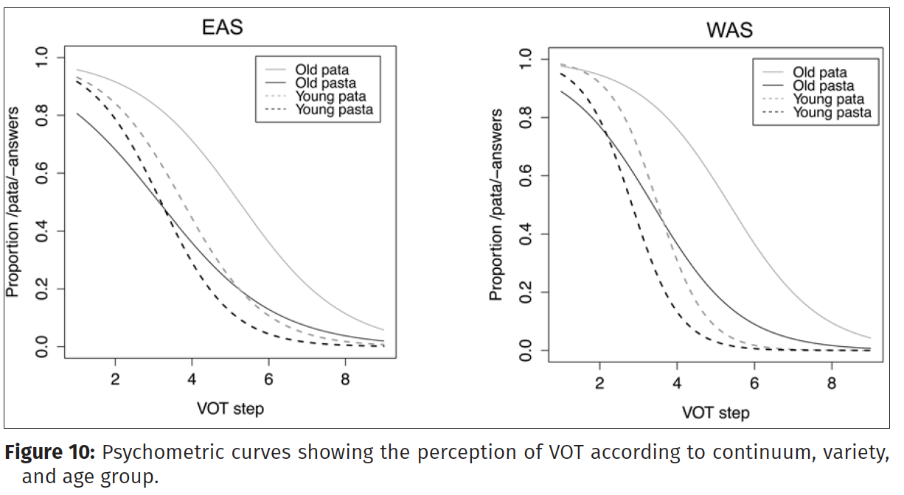

# Introduction

* Weakening of syllable-final fricatives is a process that is common to many languages.

* In Spanish, /s/ aspiration occurs in many varieties and it has been shown to vary with speech style and the speaker's social variables.

* Several factors have been shown to favour weakening of syllable-final /s/ in Spanish, such as **occurrence in unstressed syllables**, **fast speech rate**, **high lexical frequency**, and **word-medial position preceding consonants**.

* This leads to high variability of syllable-final /s/ when it comes to its phonetic realization ([∅], [s], [h], [hs]).

* The phenomenon of /s/ lenition has been analyzed auditorily and categorically as either full [s], lenited [h], or elision [∅]. This gives the impression that /s/ varies categorically and does not account for compensary processes such as lengthening of preceding vowel or following consonant.

---

# The present study

* Moves away from assumed stable variation of /s/ aspiration in Spanish.

 

* **GOAL**: to show how syllable-final /s/ preceding voiceless stops (/p t k/) is in Andalusian Spanish variably realized as:

  + (1) aspiration preceding the stop closure (e.g., pasta ['pahta]),
  
  + (2) following the stop closure (pasra ['patha]), 
  
  + (3) or both (['pahtha])
  
 
  
* And how its realization changes in apparent-time, giving rise to a new sound in this variety: a **post-aspirated stop**.

---

# The present study

* The focus in **Andalusian** Spanish because:

  + Syllable-final /s/ is generally weakened even in formal speech situations.
  
  + The realization of lenited /s/ is itself highly variable synchronically.
  
  + The phonological sequences /sp, st, sk/ are of particular interes because they have been found to be produced:
  
      + (1) with aspiration preceding the stop closure,
      
      + (2) with aspiration subsequent to the stop closure, 
      
      + (3) and with a long stop closure.
      
  + There is variation between Eastern and Western Andalusian Spanish (EAS/WAS), which has been interpreted as a result of a sound **change in progress**, with the possible result that in WAS post-aspirated stops [ph, th, kh] are already phonologized.
  
---

# The present study

* With this, there are three aims to this study:

    + **(1)**: to assess whether the sound change from pre- to post-aspiration takes hold for /st/, /sk/, and /sp/ sequences.
  
    + **(2)**: to systematically compare velar, dental, and bilabial stops in order to understand in which contexts the sound change might have started and which articulatory factors might have brought it about.
  
    + **(3)**: to tackle the hypothetical process of phonologization of post-aspirated stops in this variety of Spanish by testing if Andalusian listeners use post-aspiration as a perceptual cue to /st/ sequences.
  
---

# Experiment 1: Production

**Method**

*Participants*

  * 48 subjects - Native speakers of Andalusian Spanish:
  
    + 24 were from Seville (Western Andalusia)
    
    + 24 were from Granada (Eastern Andalusia)
    
    + For each variety, there was an **older** group (55-79) and a **younger** group (20-36).
    
*Materials*

  + 18 isolated target words
  
  + Trysyllabic words with either intervocalic /s/ + voiceless stop sequences (e.g., espada, estado, escapa) or intervocalic singleton stops (e.g., separa, etapa, secaba), embedded into an /e_a/ context. Unstressed syllable.

---

# Experiment 1: Production

**Method**

*Procedure*

  * One recording session consisted of:
  
    + A semi-directed interview
    
    + Reading a text
    
    + Reading isolated words (target words embedded)
    
  * Participants had to read target and non-target words on a laptop monitor at a constant rate of over 40 words per minute. Total: 181 words/speaker.
  
  * Target words were segmented automatically and then the segment boundaries were adjusted manually for: the onset of V1 (V1.Onset), the onset (Cl.Onset) and offset of oral closure (Cl.Offset), and the offset of V2 (V2.Offset).
  
---

* Voice Termination Time (VTT): interval between V1.Offset and Cl.Onset. used to measure the duration of **pre-aspiration**.

* Voice Onset Time (VOT): interval between Cl.Offset and V2.Onset. Used to measure post-aspiration duration.

---

# Results

*Voice Termination Time*

  * For hC-words (e.g., estado, escapa, espada), voicing ends prior to the oral closure, i.e., they are pre-aspirated.
  
  * For C-words (e.g., etapa, secaba, separa), voicing extends into the oral closure.
  
  * Younger and older speakers did not differ significantly in C-words, but thet did significantly in hC-words in WAS, but not in EAS. This means that younger speakers of WAS produced shorter pre-aspiration than older speakers in hC-words.
  
  * VTT varied with age and place of articulation: VTT was longer before velar stops and longer for older than for younger speakers.
  
  * There was no significant difference in VTT between EAS and WAS.
  
---

# Results

*Voice Onset Time*

  * Typical VOT patterns in C-words and in hC-words: bilabial stops show the shortest VOT, velar stops the longest.
  
  * Younger WAS speakers: VOT in dental stops exceeds that of velar stops in hC-words.
  
  * VOT is longer in hC-words than in C-words. Younger and WAS speakers: longest VOT.
  
  * Younger speakers of EAS and WAS produced hC-words with a longer post-aspiration than C-words, while older speakers of EAS and WAS did not differ in their VOT.
  
  * Age was significant among all three stops in WAS, and in EAS among ht, but not hp and hk words.
  
---

# Discussion

* VTT: Younger speakers produced hC-sequences with a shorter VTT than older speakers, but the differences was only significant in WAS, not EAS. This suggests that in WAS pre-aspiration is fading in apparent-time.

* VOT: much more variability.

  + In hC-sequences, it was longest for young WAS, and generally longer for WAS and younger than EAS and older speakers. This suggests that /s/ + voiceless stop sequences VOT is lengthening in apparent time.

  + Younger and older speakers differed in terms of VOT for all three stop types /sp, st, sk/ in WAS, and only for /st/ in EAS. This suggests that the sound change is more advanced in WAS than in EAS.
  
  + This also suggests that, at least in EAS, the sound change first affects /st/ sequences, and only later might generalize to /sp, sk/ sequences.

---
  
# Discussion

  * Given these results, the authors wonder if this diachronic change is mainly due to a change in the duration and timing of the oral closure gesture, or to the timing of the glottal opening gesture itself changing over time.
  
  * They a subsequent analysis with three more durational parameters of C- and hC-sequences:
    
    + **(1)**: Total duration of the voiceless interval
  
    + **(2)**: Duration of the preceding vowel
    
    + **(3)**: Oral stop closure
    
---
  
# Results

  * Total duration of voiceless interval was significantly longer in hC-sequences than in intervocalic stops for both varieties and age groups. Aslo, the total duration of hC-sequences is very stable across varieties, place of articulation, and age groups: not affected by sound change.
  
  * No effect of age or variety on the duration of the preceding vowel, suggesting that the glottal opening gesture dies not take place later in time in younger than in older speakers. Contrary, vowels were slightly shorter when followed by a phonological /s/ + voiceless stop than when preceding intervocalic stops. This still does not support the assumpltion of vowel lengthening as a compensation for /s/ lenition.
  
  * Closure duration. Significant: longer duration in hC- than in C-sequences in all four groups. Effect less marked in younger WAS speakers, who also produced the longest post-aspiration. This suggests that long stop closures might have arisen previous to the sound change.
  
---

# Experiment 2: Perception

**Method**

*Participants*

  * 79 participants (5 were discarded). 74 total.
  
    + From Seville: 39 (14 women; 25 men)
    
    + From Granada: 35 (16 women; 19 men)
    
    + Between 18 and 86 years old.
    
*Materials*

  * VOT continuum: "Digo pasta" (VOT: 55 ms) - "Digo pata" (VOT: 13 ms).
  
    + Pasta-continuum: shortening VOT eight times, 5 ms, until 15 ms.
    
    + Pata-continuum: generated by replacing the short original VOT by the long VOT of pasta (55 ms)
  
  * Produced by 31-year-old female speaker from Seville.
  
---

# Experiment 2: Perception

**Method**

*Procedure*
  
  * Forced-choice perception task.
  
  * Listeners were told that they would hear an Andalusian woman saying "pata" or "pasta".
  
  * They were asked to judge if they heard "pata" or "pasta" and mark their answer on the screen.
  
  * They could only listen to it once. No training.
  
  * The experiment took between 10 to 30 minutes.
  
---

# Results

  
* Older listeners needed a longer VOT to perceive "pasta" than younger subjects.

---

* The endpoints of the VOT-continua were identified consistently as /pata/ or /pasta/ by all four groups.

* Psychometric surves of younger listeners appear to be steeper than those of the older listeners.

* EA speakers show a flatter psychosometric curve than WA subjects, this difference being more marked than for older subjects.

---

* Psychometric curves were again calculated for each of the two continua.

* In both varieties, the curves of pasta-continuum are slightly left-shifted, meaning that the participants gave fewer "pata" answers than when the continuum was generated based on "pata".

* This trend is more pronounced for older than for younger listerners.

---

# Discussion

* Younger and older listeners of EAS and WAS were able to distinguish the minimal pair pata-pasta that differed only in VOT.

* Younger listeners were more sensitive to post-aspiration as a cue for /st/ than older listeners.

* WAS speakers have a more categorical perception of post-aspiration in this minimal pair, i.e., they distinguish more consistently between stimuli containing either a short or a long VOT.

* These results suggest that this change in progress from pre- to post-aspiration also affects perception.

* There is a relationship between production and perception of post-aspiration.

  
  
  
  
  
  
  
  
  

